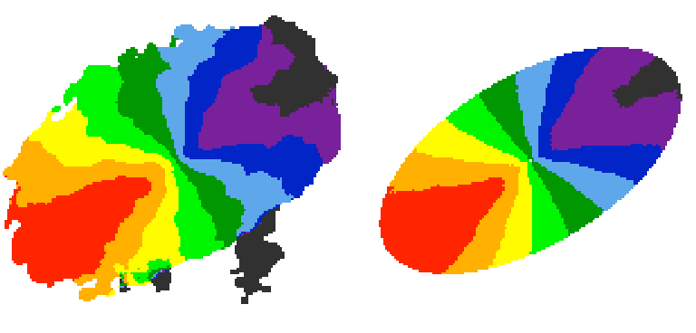

.. _2dfit:

2DFIT task
#############

The classical 2D tilted-ring modelling of a galaxy: a model velocity field is fitted to the observed velocity field (see, e.g., `Begeman 1987 <http://adsabs.harvard.edu/abs/1987PhDT.......199B>`_). This technique is fast and good for high spatial resolution data, but completely unreliable for low resolution data (no beam smearing correction).

Parameters
===========

* **2DFIT** [false]. This flag enables the 2D fitting of the velocity field.

Parameters and options that control the task are in common with :ref:`3DFIT <3dfitopt>`. In particular, 2DFIT supports the following parameters: **NRADII**, **RADSEP**, **XPOS**, **YPOS**, **VSYS**, **VROT**, **VRAD**, **PA**, **INC**, **FREE**, **SIDE**, **WFUNC**. If **FITSFILE** is a datacube, the velocity field to fit is extracted as 1st moment using a mask for the input datacube defined by the **MASK** parameter (written in the output directory). If **FITSFILE** is a 2D velocity map, this is used to fit the tilted-ring model.

Outputs
========

The task produces the following outputs. *NAME* is the name of the galaxy.

* A FITS file *NAMEmap_1st.fits* with the velocity field used for the fit.

* A FITS file *NAMEmao_2d_mod.fits*, containing the model velocity field.

* A text file *NAME_2dtrm.txt*, with the best-fit parameters ring-by-ring.

Example
========
The following example :download:`parameter <examples/n2403_2dfit.par>` fits a 2D tilted-ring model to the usual NGC2403 :download:`datacube <examples/ngc2403.fits>`.

.. literalinclude:: examples/n2403_2dfit.par
   :language: c

   
   Observed (left) and modelled (right) velocity field for NGC 2403. 
