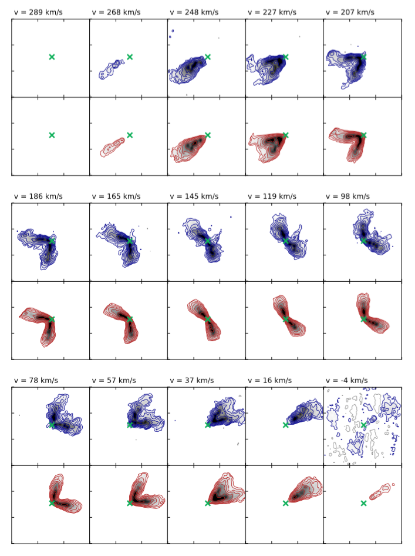
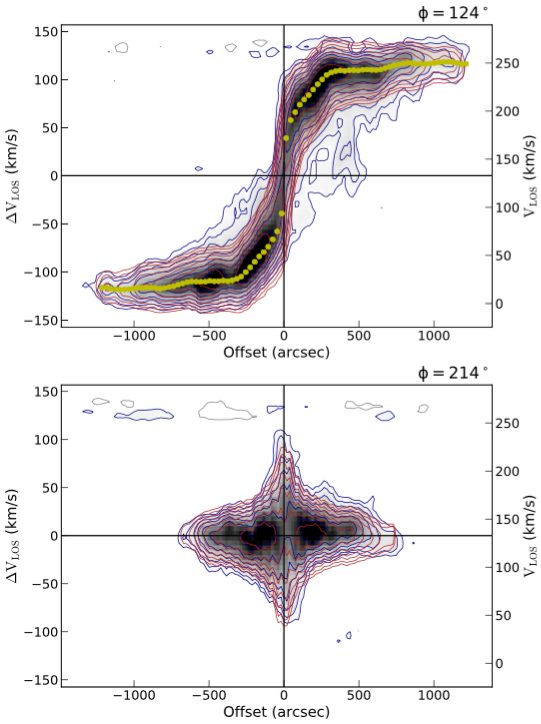
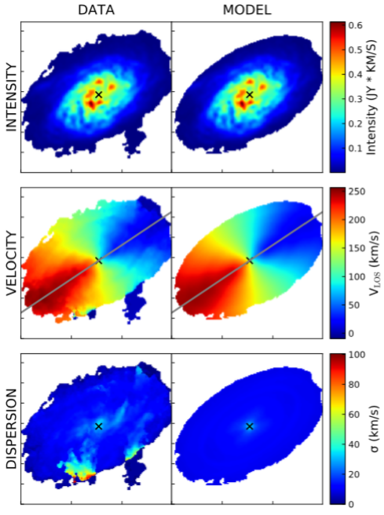
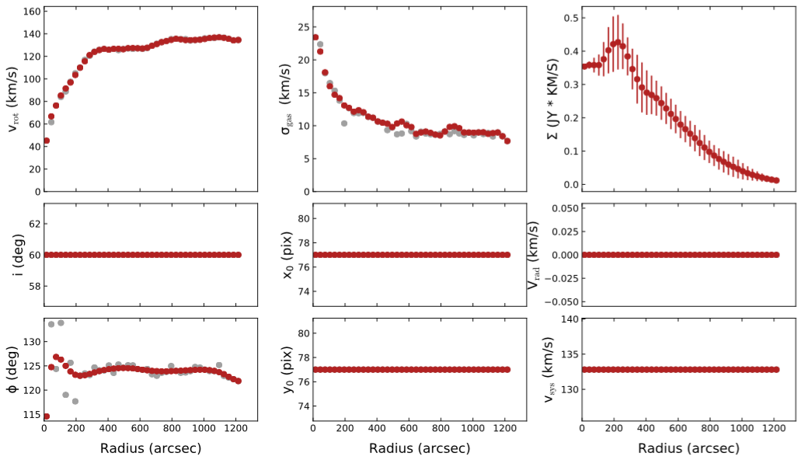

.. _3dfit:

3DFIT task
###########

3DFIT is the main BBarolo's routine: it fits a 3D tilted-ring model to an emission-line data-cube. Algorithms used are described in `this paper <http://adsabs.harvard.edu/abs/2015MNRAS.451.3021D>`_.

Parameters
==========

* **3DFIT** [false]. This flag enables the 3D fitting algorithm. Can be *true* or *false*. The old flag GALFIT is now deprecated and will be no more supported in future BBarolo's releases.

.. _ringio:

Rings input
^^^^^^^^^^^^^

Following parameters are used to define the set of rings used for the fit. All parameters are allowed to vary ring-by-ring or to be fixed. In the first case, given values represent initial guesses for the fit.

All parameters listed below (except NRADII and RADSEP) can be given in the form of a single value valid for all rings or through a text file containing values at different radii. In this second case, the sintax to be used is *file(filename,N,M)*, where *filename* is the name of the file with values, *N* is the column number (counting from 1) and *M* is the starting row (all rows if omitted).

* **NRADII** [none]. The number of rings to be used and fitted. If not given, BBarolo tries to guess it from the size of the galaxy.

* **RADSEP** [none]. The separation between rings in *arcsec*. If N radii have been requested, the rings will be placed at N*RADSEP + RADSEP/2. If not given, BBarolo assumes the FWHM of the beam major axis as radius separation. 

* **RADII** [none]. This parameter can be used as an alternative to NRADII and RADSEP. This needs to be a text file (see above).

* **XPOS** [none]. X-center of rings. Accepted format are in *pixels* (starting from 0, unlike GIPSY) or in WCS coordinates in the format +000.0000d (*degrees*) or +00:00:00.00 (*sexagesimal*). If not specified, BBarolo tries to guess it using the 3D source finder.

* **YPOS** [none]. Like XPOS, but for the y-axis.

* **VSYS** [none]. Systemic velocity in *km/s*. If not given, BBarolo tries to guess it from the global line profile.

* **VROT** [none]. Rotation velocity in *km/s*. If not given, BBarolo tries to guess it.

* **VDISP** [8]. Velocity dispersion in *km/s*. 

* **VRAD** [0]. Radial velocity in *km/s*. 

* **INC** [none]. Inclination in *degrees*. If not given, BBarolo tries to guess it from the column density map.

* **PA** [none]. Position angle in *degrees*, measured anti-clockwise form the North direction. If not given, BBarolo tries to guess it from the velocity field.

* **Z0** [0]. Scale-height of the disc in *arcsec*. 

* **DENS** [1]. Gas surface density in units of *1E20 atoms/cm2*. Fit of this parameter is not currently implemented and its value is not relevant if a normalization is used. 

.. _3dfitopt:

Additional options
^^^^^^^^^^^^^^^^^^

Additional parameters to control and refine the fit. All following parameters have default values and are therefore optional.

* **DELTAINC** [5]. This parameter fixes the boundaries of parameter space at [INC-DELTAINC, INC+DELTAINC]. It is not advisable to let the inclination varying over the whole range [0,90].

* **DELTAPA** [15]. This parameter fixes the boundaries of parameter space at [PA-DELTAINC, PA+DELTAPA]. It is not advisable to let the position angle varying over the whole range [0,360].

* **FREE** [VROT VDISP INC PA]. The list of parameters to fit. Can be any combination of VROT, VDISP, VRAD, VSYS, INC, PA, Z0, XPOS, YPOS.

* **FTYPE** [2]. Function to be minimized. Accepted values are: 1 = chi-squared, 2 = \|mod-obs\|, (default) and 3 = \|mod-obs\|/(mod+obs)).

* **WFUNC** [2]. Weighting function to be used in the fit. Accepted values are: 0 = uniform weight, 1 = \|cos(θ)\| and 2 = cos(θ)^2, default), where θ is the azimuthal angle (= 0 for galaxy major axis).

* **LTYPE** [1]. Layer type along z. Accepted values are: 1 = Gaussian (default), 2  = sech^2, 3 = exponential, 4 = Lorentzian and 5 = box.

* **CDENS** [10]. Surface density of clouds in the plane of the rings per area of a pixel in units of *1E20 atoms/cm^2* (see also GIPSY `GALMOD <https://www.astro.rug.nl/~gipsy/tsk/galmod.dc1>`_).

* **NV** [nchan]. Number of subclouds in the velocity profile of a single cloud (see also GIPSY `GALMOD <https://www.astro.rug.nl/~gipsy/tsk/galmod.dc1>`_). Default is the number of channels in the datacube.

* **SIDE** [B]: Side of the galaxy to be fitted. Accepted values are: A = approaching, R = receding and B = both (default)

* **MASK** [SMOOTH]. This parameter tells the code how to build a mask to identify the regions of genuine galaxy emission. Accepted values are *SMOOTH*, *SEARCH*, *SMOOTH&SEARCH*, *THRESHOLD*, *NONE* or a FITS mask file:

  * *SMOOTH*: the input cube is smoothed according to the :ref:`smooth parameters <smoothtask>` and the mask built from the region at S/N>BLANKCUT, where **BLANKCUT** is a parameter representing the S/N cut to apply in the smoothed datacube. Defaults are to smooth by a FACTOR = 2 and cut at BLANKCUT = 3.
  
  * *SEARCH*: the source finding is run and the largest detection used to determine the mask. The :ref:`source finding parameters <searchtask>` can be set to change the default values. 
  
  * *SMOOTH&SEARCH*: first smooth to a lower resolution and then scan the smoothed data for sources. Parameters for smoothing and source-finding are the same as the :ref:`SMOOTH <smoothtask>` and :ref:`SEARCH <searchtask>` tasks.
  
  * *THRESHOLD*: blank all pixels with flux < THRESHOLD. A **THRESHOLD** parameter must be specified in the same flux units of the input datacube. 
  
  *  *NONE*: all regions with flux > 0 are used. 
  
  * *file(fitsname.fits)*: A mask FITS file (i.e. filled with 0,1).

* **NORM** [LOCAL]. Type of normalization of the model. Accepted values are: *LOCAL* (pixel by pixel), *AZIM* (azimuthal) or *NONE*.

* **TWOSTAGE** [true]. This flag enables the second fitting stage after parameter regularization. This is relevant just if the user wishes to fit parameters other than VROT, VDISP, VRAD and VVERT. The inclination and the position angle are regularized by polynomials of degree POLYN or a Bezier function (default), while the other parameters by constant functions.

* **POLYN** [-1]. Degree of polynomials for the regularization of inclination and position angles. -1 enables the Bezier function.

* **BWEIGHT** [2]. Exponent of weight for blank pixels. See Section 2.4 of reference paper for details.

* **FLAGERRORS** [false]. Whether the code has to estimate the errors. This usually heavily slows down the run.

* **STARTRAD** [0]. This parameter allows the user to start the fit from the given ring. Indexing from 0.

* **LINEAR** [0.85]. This parameter controls the spectral broadening of the instrument. It is in units of channel and it represents the standard deviation, not the FWHM. The default is for data that has been Hanning smoothed, so that FWHM = 2 channels and σ = FWHM/2.355.

Additional parameters for high-z galaxies 
^^^^^^^^^^^^^^^^^^^^^^^^^^^^^^^^^^^^^^^^^^

For high-z galaxies the following additional parameters are available.

* **REDSHIFT** [0]. The redshift of the galaxy.

* **RESTWAVE** [none]. The rest wavelength of the line you want to fit, if the spectral axis of the data is wavelength. Units must be the same of the spectral axis of the cube. For example, if we want to fit the H-alpha line and CUNIT3 = "angstrom", set a value 6563. 

* **RESTFREQ** [none]. The rest frequency of the line you want to fit, if the spectral axis of the data is frequency. Units must be the same of the spectral axis of the cube. The rest frequency value is often read from the FITS header and does not need to be explicitly set by the user. If set, the RESTFREQ value overrides the header value.

These two parameters are used to calculate the conversion from wavelengths/frequencies to velocities. The velocity reference is set to 0 at RESTWAVE*(REDSHIFT+1) or RESTFREQ/(REDSHIFT+1). VSYS has to be set to 0, but can be also used to fine-tune the redshift. Finally, if these two parameters are not set, BBarolo will use the CRPIX3 as velocity reference and the proper VSYS has to be set based on that.

Outputs
========

The 3DFIT task produces several outputs to check the goodness of the fit. In the following *NAME* is the name of the galaxy and *NORM* is the kind normalization used.

* A FITS file *NAMEmod_NORM.fits*, containing the best-fit model datacube.

* A FITS file *mask.fits*, containing the mask used for the fit. 

* FITS files of position-velocity cuts taken along the average major and minor axes for the data and the best-fit model. In particular:

  * *NAME_pv_a.fits*: P-V of the data along the major axis.
  * *NAME_pv_b.fits*: P-V of the data along the minor axis.
  * *NAMEmod_pv_a_NORM.fits*: P-V of the model along the major axis.
  * *NAMEmod_pv_b_NORM.fits*: P-V of the model along the minor axis.

* FITS files of the moment maps for the data and the model. These can be found in the *maps* subdirectory:
  
  * *NAME_0mom.fits*, *NAME_1mom.fits*, *NAME_2mom.fits:* 0th, 1st and 2nd moment maps of the data.
  * *NAME_NORM_0mom.fits*, *NAME_NORM_1mom.fits*, *NAME_NORM_2mom.fits:* 0th, 1st and 2nd moment maps of the model.

* Text files *ringlog1.txt* and *ringlog2.txt*, containing the ring best-fit parameters for the first and second fitting steps. The file *ringlog2.txt* is only produced if **TWOSTAGE** is true.

* A text file *densprof.txt*, with the radial intensity profiles along the best-fit rings.

* A Gnuplot script *gnuscript.gnu* to plot P-V diagrams and best-fit parameters. This is only used if Gnuplot support is on and Python support is off.

* A Python script *pyscript.py* to conveniently plot all the above outputs. This script produces all the following plots.

* A PDF file *plot_chanmaps_NORM.pdf* with a channel-by-channel comparison of data and model cubes.

   
|
|

* A PDF file *plot_pv_NORM.pdf* with a comparison of data and model P-Vs taken along the average major and minor axes.

   
|
|
 
* A PDF file *plot_maps_NORM.pdf* with a comparison of data and model moment maps.

   
|
|

* A PDF file *plot_parameters.pdf* with the best-fit parameters.

Example
========
Above outputs can be obtained with the following :download:`parameter <examples/n2403_3dfit.par>` file and the usual example :download:`datacube <examples/ngc2403.fits>`.

.. literalinclude:: examples/n2403_3dfit.par
   :language: c

