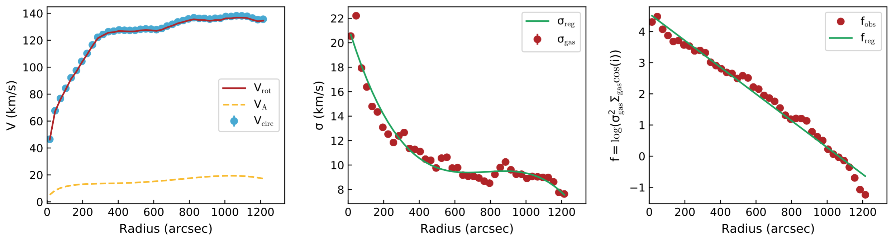

.. _3dfit:

3DFIT task
###########

3DFIT is the main BBarolo's routine: it fits a 3D tilted-ring model to an emission-line data-cube. Algorithms used are described in `this paper <http://adsabs.harvard.edu/abs/2015MNRAS.451.3021D>`_.

Parameters
==========

* **3DFIT** [false]. This flag enables the 3D fitting algorithm. Can be *true* or *false*. The old flag GALFIT is now deprecated and will be no more supported in future BBarolo's releases.

.. _ringio:

Rings input
^^^^^^^^^^^^^

Following parameters are used to define the initial set of rings used for the fit. All parameters are allowed to vary ring-by-ring or they can just be fixed to their initial value.

All parameters listed below (except NRADII and RADSEP) can be given in the form of a single value valid for all rings or through a text file containing values at different radii. In this second case, the syntax to be used is *file(filename,N,M)*, where *filename* is the name of the file with values, *N* is the column number (counting from 1) and *M* is the starting row (all rows if omitted).

If any of the following parameters is not explicitly specified, BBarolo will estimate an appropriate initial value for that parameter.

* **NRADII** [none]. The number of rings to be used and fitted. If not given, BBarolo will determine it from the radial extension of the emission line.

* **RADSEP** [none]. The separation between rings in *arcsec*. If N radii have been requested, the rings will be placed at N*RADSEP + RADSEP/2. If not given, it will be equal to the FWHM of the beam major axis.

* **RADII** [none]. This parameter can be used as an alternative to NRADII and RADSEP. This needs to be a text file (see above).

* **XPOS** [none]. X-center of rings. Accepted format are in *pixels* (starting from 0, unlike GIPSY) or in WCS coordinates in the format +000.0000d (*degrees*) or +00:00:00.00 (*sexagesimal*). If not specified, it is determined from the centroids of the emission.

* **YPOS** [none]. Like XPOS, but for the y-axis.

* **VSYS** [none]. Systemic velocity in *km/s*. If not given, it is estimated as the central velocity in the global line profile.

* **VROT** [none]. Rotation velocity in *km/s*.

* **VDISP** [8]. Velocity dispersion in *km/s*. 

* **VRAD** [0]. Radial velocity in *km/s*. 

* **INC** [none]. Inclination in *degrees*. If not given, it is guessed from the total map.

* **PA** [none]. Position angle in *degrees* of the receding side of the galaxy, measured anti-clockwise from the North direction. If not given, it is estimated from the velocity field.

* **Z0** [0]. Scale-height of the disc in *arcsec*. 

* **DENS** [1]. Gas surface density in units of *1E20 atoms/cm2*. Fit of this parameter is not currently implemented and its value is not relevant if a normalization is used. 

.. _3dfitopt:

Main options
^^^^^^^^^^^^^^^^^^

Some important parameters that can be used to control 3DFIT. All following parameters have default values and are therefore optional.

* **FREE** [VROT VDISP INC PA]. The list of parameters to fit. Can be any combination of VROT, VDISP, VRAD, VSYS, INC, PA, Z0, XPOS, YPOS.

* **MASK** [SMOOTH]. This parameter tells the code how to build a mask to identify the regions of genuine galaxy emission. Accepted values are *SMOOTH*, *SEARCH*, *SMOOTH&SEARCH*, *THRESHOLD*, *NONE* or a FITS mask file:

  * *SMOOTH*: the input cube is smoothed according to the :ref:`smooth parameters <smoothtask>` and the mask built from the region at S/N>BLANKCUT, where **BLANKCUT** is a parameter representing the S/N cut to apply in the smoothed datacube. Defaults are to smooth by a FACTOR = 2 and cut at BLANKCUT = 3.
  
  * *SEARCH*: the source finding is run and the largest detection used to determine the mask. The :ref:`source finding parameters <searchtask>` can be set to change the default values. 
  
  * *SMOOTH&SEARCH*: first smooth to a lower resolution and then scan the smoothed data for sources. Parameters for smoothing and source-finding are the same as the :ref:`SMOOTH <smoothtask>` and :ref:`SEARCH <searchtask>` tasks.
  
  * *THRESHOLD*: blank all pixels with flux < THRESHOLD. A **THRESHOLD** parameter must be specified in the same flux units of the input datacube. 
  
  * *NONE*: all regions with flux > 0 are used. 
  
  * *file(fitsname.fits)*: A mask FITS file (i.e. filled with 0s and 1s).
  
* **NORM** [LOCAL]. Type of normalization of the model. Accepted values are: *LOCAL* (pixel by pixel), *AZIM* (azimuthal) or *NONE*.

* **TWOSTAGE** [true]. This flag enables the second fitting stage after parameter regularisation. This is relevant just if the user wishes to fit parameters other than VROT, VDISP and VRAD. The inclination and the position angle are regularised by polynomials of degree POLYN or a Bezier function (default), while the other parameters by constant functions.

* **REGTYPE** [auto]. Type of regularisation to use for second fitting stage. Accepted values are *auto* (the code will choose), *bezier* (Bezier interpolation), *median* (take the median), or a positive integer *n* for a nth-degree polynomial interpolation. It is possible to choose different types for INC, PA, VSYS, XPOS, YPOS and Z0 with a list of keyword-value pairs separated with whitespaces. A single value is used only to set INC and PA together. For example::

    REGTYPE   bezier                 # Bezier function for INC and PA, 'auto' for others
    REGTYPE   INC=1 PA=median        # A line for INC, median for PA
    REGTYPE   INC=2 PA=0 VSYS=bezier # A parabola for INC, a constant for PA, bezier for VSYS

* **POLYN** [-1]. **DEPRECATED**. It will be discontinued after v1.6, use REGTYPE instead.

* **LINEAR** [0.85]. This parameter controls the spectral broadening of the instrument. It is in units of channel and it represents the standard deviation, not the FWHM. The default is for data that has been Hanning smoothed, so that FWHM = 2 channels and LINEAR = FWHM/2.355.

* **SIDE** [B]: Side of the galaxy to be fitted. Accepted values are: A = approaching, R = receding and B = both (default)

* **FLAGERRORS** [false]. Whether the code has to estimate the errors. This heavily slows down the run.

* **ADRIFT** [false]. If true, calculate the asymmetric drift correction. First regularize velocity dispersion and density profile and then compute the correction following classical prescription (see e.g. `Iorio et al. 2017 <http://adsabs.harvard.edu/abs/2017MNRAS.466.4159I>`_).

.. _3dfitopt_add:

Advanced options
^^^^^^^^^^^^^^^^

Additional optional parameters to refine the fit for advanced users. 

* **DELTAINC** [5]. This parameter fixes the boundaries of parameter space at [INC-DELTAINC, INC+DELTAINC]. It is not advisable to let the inclination varying over the whole range [0,90].

* **DELTAPA** [15]. This parameter fixes the boundaries of parameter space at [PA-DELTAINC, PA+DELTAPA]. It is not advisable to let the position angle varying over the whole range [0,360].

* **DELTAVROT** [inf]. This parameter fixes the boundaries of parameter space at [VROT-DELTAVROT, VROT+DELTAVROT]. Default is not to limit rotation velocity.

* **MINVDISP** [0]. Minimum gas velocity dispersion allowed.

* **MAXVDISP** [1000]. Maximum gas velocity dispersion allowed.

* **FTYPE** [2]. Function to be minimized. Accepted values are: 1 = chi-squared, 2 = \|mod-obs\|, (default) and 3 = \|mod-obs\|/(mod+obs)).

* **WFUNC** [2]. Weighting function to be used in the fit. Accepted values are: 0 = uniform weight, 1 = \|cos(θ)\| and 2 = cos(θ)^2, default), where θ is the azimuthal angle (= 0 for galaxy major axis). Negative values can be used to set a sin(θ) weight: -1 = \|sin(θ)\| and -2 = sin(θ)^2.

* **LTYPE** [1]. Layer type along z. Accepted values are: 1 = Gaussian (default), 2  = sech^2, 3 = exponential, 4 = Lorentzian and 5 = box.

* **CDENS** [10]. Surface density of clouds in the plane of the rings per area of a pixel in units of *1E20 atoms/cm^2* (see also GIPSY `GALMOD <https://www.astro.rug.nl/~gipsy/tsk/galmod.dc1>`_).

* **NV** [nchan]. Number of subclouds in the velocity profile of a single cloud (see also GIPSY `GALMOD <https://www.astro.rug.nl/~gipsy/tsk/galmod.dc1>`_). Default is the number of channels in the datacube.

* **BWEIGHT** [1]. Exponent of weight for blank pixels. See Section 2.4 of reference paper for details. Large numbers mean that models that extend further away than observations are severely discouraged.

* **STARTRAD** [0]. This parameter allows the user to start the fit from the given ring. Indexing from 0.

* **PLOTMASK** [false]. If true, the mask contour is overlaid on the channel maps and PVs plots.

* **NOISERMS** [0] If > 0, Gaussian noise with rms = NOISERMS will be added to the final model cube.

* **NORMALCUBE** [true]. If true, the input cube is normalized before the fit. This usually helps convergence and avoids issues with very small flux values.

* **BADOUT** [false]. If true, it writes also unconverged/bad rings in the output ringfile (with a flag identifying them).

Parameters for high-z galaxies 
^^^^^^^^^^^^^^^^^^^^^^^^^^^^^^^^^^^^^^^^^^

For high-z galaxies the following additional parameters are available.

* **REDSHIFT** [0]. The redshift of the galaxy.

* **RESTWAVE** [none]. The rest wavelength of the line you want to fit, if the spectral axis of the data is wavelength. Units must be the same of the spectral axis of the cube. For example, if we want to fit the H-alpha line and CUNIT3 = "angstrom", set a value 6563. It can be a single value, or a list of values for fitting multiple lines at the same time.

* **RESTFREQ** [none]. The rest frequency of the line you want to fit, if the spectral axis of the data is frequency. Units must be the same of the spectral axis of the cube. The rest frequency value is often read from the FITS header and does not need to be explicitly set by the user. If set, the RESTFREQ value overrides the header value. It can be a single value, or a list of values for fitting multiple lines at the same time.

These parameters are used to calculate the conversion from wavelengths/frequencies to velocities. The velocity reference is set to 0 at RESTWAVE*(REDSHIFT+1) or RESTFREQ/(REDSHIFT+1). VSYS has to be set to 0, but can be also used to fine-tune the redshift. Finally, if these two parameters are not set, BBarolo will use the CRPIX3 as velocity reference and the proper VSYS has to be set based on that.

* **RELINT** [1]. A list of line ratios for multiple line fitting. The number of ratios must be the same of given **RESTFREQ** or **RESTWAVE**. 

Outputs
========

The 3DFIT task produces several outputs to check the goodness of the fit. In the following *NAME* is the name of the galaxy and *NORM* is the kind normalization used.

* A FITS file *NAMEmod_NORM.fits*, containing the best-fit model datacube.

* A FITS file *mask.fits*, containing the mask used for the fit. 

* FITS files of position-velocity cuts taken along the average major and minor axes for the data and the best-fit model. In particular:

  * *NAME_pv_a.fits*: P-V of the data along the major axis.
  * *NAME_pv_b.fits*: P-V of the data along the minor axis.
  * *NAMEmod_pv_a_NORM.fits*: P-V of the model along the major axis.
  * *NAMEmod_pv_b_NORM.fits*: P-V of the model along the minor axis.

* FITS files of the moment maps for the data and the model. These can be found in the *maps* subdirectory:
  
  * *NAME_0mom.fits*, *NAME_1mom.fits*, *NAME_2mom.fits:* 0th, 1st and 2nd moment maps of the data.
  * *NAME_NORM_0mom.fits*, *NAME_NORM_1mom.fits*, *NAME_NORM_2mom.fits:* 0th, 1st and 2nd moment maps of the model.

* Text files *rings_final1.txt* and *rings_final2.txt*, containing the ring best-fit parameters for the first and second fitting steps. The file *rings_final2.txt* is only produced if **TWOSTAGE** is true.

* A text file *densprof.txt*, with the radial intensity profiles along the best-fit rings.

* If **ADRIFT** is true, a text file *asymdrift.txt* with the asymmetric drift correction parameters.

* Plotting scripts to produce output plots with Gnuplot/Python can be found in the *plotscripts* subdirectory.

* A PDF file *NAME_chanmaps_NORM.pdf* with a channel-by-channel comparison of data and model cubes.

.. figure:: examples/channels.png
   :alt: Channel maps plot
   :figwidth: 100%
   :align: center
   
|
|

* A PDF file *NAME_pv_NORM.pdf* with a comparison of data and model P-Vs taken along the average major and minor axes.

.. figure:: examples/pvs.png
   :alt: Position-velocity plots
   :figwidth: 100%
   :align: center
   
|
|
 
* A PDF file *NAME_maps_NORM.pdf* with a comparison of data and model moment maps.

.. figure:: examples/mom.png
   :alt: Position-velocity plots
   :figwidth: 100%
   :align: center
   
|
|

* A PDF file *NAME_parameters.pdf* with the best-fit parameters.

.. figure:: examples/params.png
   :alt: Position-velocity plots
   :figwidth: 100%
   :align: center

|
|

* If **ADRIFT** is true, a PDF file *asymmetricdrift.pdf* with the asymmetric drift correction.

Example
========
Above outputs can be obtained with the following :download:`parameter <examples/n2403_3dfit.par>` file and the usual example :download:`datacube <examples/ngc2403.fits>`.

.. literalinclude:: examples/n2403_3dfit.par
   :language: c

Guidelines for a successful fit
================================

To obtain a good fit with very low resolution data, I usually follow some basic steps:

| 1. *Observational parameters*. Check that the header of your datacube has information on the PSF/beam of your observations. These are usually stored in the BMAJ, BMIN and BPA keywords. If these are not present in the header, you can use the :ref:`beam parameters <beam>` to specify them. Be sure also to set the correct spectral broadening with the LINEAR parameter. These infos are fundamental to properly account for observational biases.

| 2. *Obtain a mask*. A good mask is important for a nice fit because it tells the code which regions are real emission and which are just noise. The mask should be as large as possible to include faint emission, but not too large to include lots of noise. Try the different algorithms available in BBarolo and compare the produced masks with your data. When you find a mask you're happy with, keep that configuration.

| 3. *Initial guesses*. The parameter space can be quite degenerate and it's very important to provide the code with reliable initial guesses for parameters. In particular, the code is very sensitive to the initial value of the inclination angle. BBarolo comes with some algorithms to automatically estimate initial values when these are not explicitly given in the parameter file. However these algorithms are simple and may fail in a number of situations, depending also on the quality of your data. If you let the code estimating the initial values, always check that these make sense before going on with the fit. I usually prefer to provide my initial guesses. I extract the moment maps using the mask just obtained and use them to get the initial guesses. Center position and inclination (XPOS, YPOS, INC) can be obtained from the intensity map. If higher resolution observations are available (like HST), I would rather use them for the galaxy center and inclination. The velocity field can be used to estimate the kinematic position angle (PA). The midpoint of the global spectrum can be used as systemic velocity (VSYS). I stress that the code is quite good in estimating the VSYS, so it is quite safe to let it unset (but always check!). The initial values of rotation velocity and velocity dispersion are not very important, so you can give some random sensible value.

| 4. *Fit*. Depending on the data, you can decide to fit several parameters at the same time or keep some of them fixed. If your data have very low resolution, it may be wise to keep the geometry fixed and fit only the kinematics (VROT and VDISP). Check the outputs and if you are not happy with the model, try to change the initial parameters and/or the :ref:`fit options <3dfitopt>`.

Fitting several galaxies at the same time
=========================================
An experimental function of BBarolo 1.5 allow the user to fit several galaxies at the same time. This can be useful, for example, when a large sample needs to be analysed on a supercluster. BBarolo launches a number of MPI processes and each process takes care of a galaxy at a time. 

To use this function, you need to compile BBarolo with MPI::

    > make mpi
    
If you have an MPI interface (OpenMPI, MPICH, etc...), this command will create an executable BBarolo_MPI in the working directory. You need to prepare a text file with a list of parameter files *params.list* and then run BBarolo_MPI through mpirun::

    > mpirun -np NPROC BBarolo_MPI -l params.list
    
where NPROC is the number of MPI processes. Each MPI process can be also run in multi-thread mode with the usual **THREADS** parameter. This is basically the same of running NPROC instances of BBarolo, each with a single parameter file.

