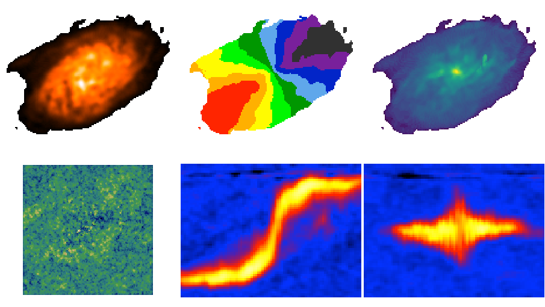

.. _momentstask:

Moment maps and position-velocity cuts 
######################################

BBarolo can be used to extract global profiles, moment maps and position velocity diagrams. For moment maps and profile, the input datacube can be masked using the MASK parameter (see :ref:`3DFIT <3dfitopt>`).

Parameters for maps
===================

* **GLOBALPROFILE** [false]. If *true*, calculate the total line profile from a datacube and write it to a text file.

* **TOTALMAP** [false]. If *true*, calculate the total intensity map from a datacube and write it to a FITS file. 

* **VELOCITYMAP** [false]. If *true*, calculate the velocity field from a datacube and write it to a FITS file. If spectral axis in the datacube is frequency/wavelength, the velocity definition can be chosen through the **VELDEF** parameter (see :ref:`3DFIT advanced options <3dfitopt_add>`).

* **DISPERSIONMAP** [false]. If *true*, calculate the velocity dispersion field from a datacube and write it to a FITS file. 

* **MAPTYPE** [MOMENT]. It specifies the way the kinematic maps are derived. Can be either *MOMENT* (classical moments) or *GAUSSIAN* (gaussian fit).

* **RMSMAP** [false]. If *true*, calculate the RMS map, i.e. the RMS in each spectrum, from a datacube and write it to a FITS file. The RMS is calculated in an iterative way. RMS is the standard deviation for normal statistics and MADFM/0.6745 for robust statistics (**FLAGROBUSTSTATS** parameter).

* **MASSDENSMAP** [false]. If *true*, calculate a mass surface-density map in units of Msun/pc^2 from a datacube and write it to a FITS file. This is just for HI data and the input datacube is required to have JY/BEAM flux density units.

* **SNMAP** [false]. If *true*, calculate a signal-to-noise map for the masked total map, following the prescriptions by `Verheijen & Sancisi (2001) <https://ui.adsabs.harvard.edu/abs/2001A%26A...370..765V/abstract>`_ and `Lelli et al. (2014) <https://ui.adsabs.harvard.edu/abs/2014MNRAS.445.1694L/abstract>`_ (see their appendixes). It has to be combined with **TOTALMAP** = *true*. The noise and S/N maps are written in individual FITS files.

* **CONTCHANS** [1E06 1E06]. Number of line-free channels at the low/high velocity ends of the data that have been used to calculate and subtract the continuum. If a single number is given, it will assume the same number of channels have been used at both velocity ends. If no continuum subtraction has been done, use large numbers (default). Only relevant if **SNMAP** is *true*.

* **TAPER** [UNIFORM]. Type of online tapering used during data acquisition. Accepted values are *UNIFORM* (uniform taper), *HANNING1* (hanning taper with all channels kept) and *HANNING2* (hanning taper with half channels thrown away). Only relevant if **SNMAP** is *true*.

Parameters for PV slices
========================

* **PVSLICE** [false]. If *true*, extract a position-velocity image from a datacube and write it to a FITS file. The slice can be defined by either a point and an angle (see **XPOS_PV**, **YPOS_PV**, **PA_PV** below), or by two points (see **P1_PV**, **P2_PV** below). The former has priority over the latter.

* **XPOS_PV** [none]. Reference X of the slice. Can be a pixel or a coordinate (see also **XPOS** for :ref:`3DFIT <ringio>`).

* **YPOS_PV** [none]. Reference X of the slice. Can be a pixel or a coordinate (see also **YPOS** for :ref:`3DFIT <ringio>`).

* **P1_PV** [none]. X and Y coordinates of the first point defining a slice. For example: '10 30' for a pixel at X=10 and Y=30. 

* **P2_PV** [none]. X and Y coordinates of the second point defining a slice. 

* **WIDTH_PV** [0]. Width of the slice in arcsec. The PV cut will be averaged over a rectangular window extending from -width/2 to +width/2 from the slice defined above.

* **ANTIALIAS** [0.5]. It defines how many pixels to use for antialiasing algorithm. It can be an integer or 0.5. The number of pixels used for antialiasing will be (1+2*ANTIALIAS)^2. Set it to 0 for no antialiasing.  

Outputs
========

The required map/P-V is written in a FITS file.

Example
=======
The following :download:`parameter <examples/n2403_moment.par>` file extract maps and PV diagrams from the usual :download:`datacube <examples/ngc2403.fits>`.

.. literalinclude:: examples/n2403_moment.par
   :language: c

   
   Moment maps, RMS map and P-Vs along the major and minor axis

