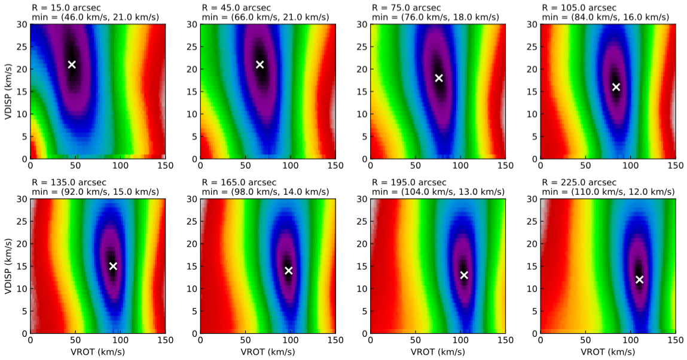

.. _spacepartask:

SPACEPAR task
#############

SPACEPAR allows the user to explore the full parameter space for any pair of :ref:`3DFIT <3dfitopt>` parameters in a given range. It is useful to check that 3DFIT is converging to a good enough minimum of the parameter space. It can be very slow to run, but it is particularly recommended for low quality observations and small data-cubes. 

Parameters
===========

Basic parameters for SPACEPAR are the same of the :ref:`3DFIT task <ringio>`. Additional specific parameters are:

* **SPACEPAR** [false]. This flag enables the SPACEPAR task. Can be *true* or *false*.

* **P1** [none]. First parameter to explore. Can be any of the 3DFIT **FREE** parameters.

* **P1PAR** [none]. A list of three numbers: the minimum value, the maximum value and the step size of the parameter space sampling for **P1**. For example, '0 100 1' samples between 0 and 100 with step size 1.

* **P2** [none]. Second parameter to explore. Can be any of the 3DFIT **FREE** parameters.

* **P2PAR** [none]. A list of three numbers: the minimum value, the maximum value and the step size of the parameter space sampling for **P2**. For example, '1 50 0.5' samples between 1 and 50 with step size 0.5.

Outputs
========
The task produces the following outputs:

* A FITS file *NAME_spacepar.fits*, containing the full parameter space for each ring.

* A FITS file *mask.fits*, containing the mask used. 

* A Python script *spacepar.py* to conveniently plot parameter spaces.

* A PDF file *NAME_spacepar.pdf* with the plots of parameter spaces for each ring (Python required), produced through the *spacepar.py* script.  Example below.

Example
========
Above outputs can be obtained with the following :download:`parameter <examples/n2403_spacepar.par>` file and the usual example :download:`datacube <examples/ngc2403.fits>`.

.. literalinclude:: examples/n2403_spacepar.par
   :language: c
    
